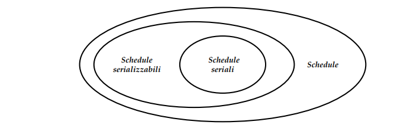
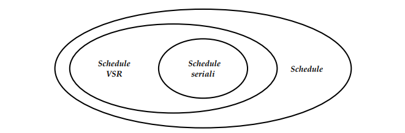
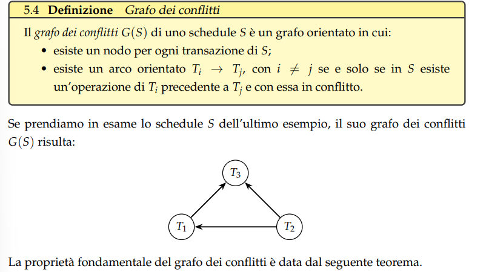
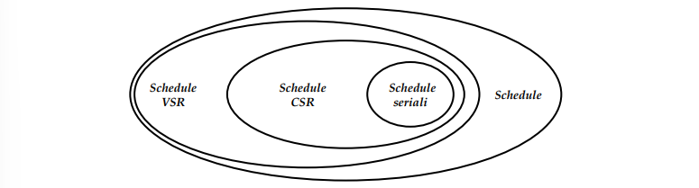

Posso dividere il lavoro delle basi di dati su più calcolatori: aumentando il numero di calcolatori aumenta l'efficienza, ma questo fino ad un certo numero di calcolatori, raggiunto un numero massimo l'efficienza non migliora più.

#### TRANSAZIONE: 
==Una transazione è una sequenza composta da operazioni elementari (indivisibili) di lettura e scrittura e da operazioni di transazione.==
Le operazioni di transazioni sono: 
- begin $b(t)$: inizio di transazione
- commit $c(t)$: terminazione con successo
- abort $a(t)$: indica la terminazione a causa di un guasto, non va a buon fine
Una transazione ha le seguenti proprietà:
- **atomicità**: solo le transazioni che terminano con successo (committed) modificano la base di dati; O TUTTO O NIENTE

- **isolamento**: quando una transazione e eseguita contemporaneamente ad altre, lo stato finale della base di dati deve essere lo stesso che otterrebbe se la transazione fosse eseguita da sola E' garantito dal gestore della concorrenza.

- **durabilità**: gli effetti delle transazioni terminate con successo devono sopravvivere ai guasti.

Una generica transazione, con omissione di $begin$ e $abort$ (aggiunte automaticamente dal DBMS e $abort$ generato automaticamente dal gestore della concorrenza), è rappresentata così:
#### $$T=p_1...p_n$$
Dove $p_i$ è un'operazione elementare, ovvero $p_i$ $\in$ {$r(x), w(x)$} per un qualche oggetto $x \in D$
 
###### **RIASSUMENDO, PER SEMPLIFICARE:**

- la base di dati è un insieme prefissato di oggetti indipendenti che possono essere solo letti o modificati;
- una transazione legge o modifica un dato oggetto al più una volta;
- tutte le transazioni terminano con successo;

---

### **GESTIONE DELLE TRANSAZIONI**

Il gestore della concorrenza si assicura che le transazioni eseguite siano gestite in maniera corretta e sicura, rispettano le proprietà [[ACID]].

Spesso e volentieri le transazioni vengono effettuate in parallelo, quindi le operazioni di lettura e scrittura simultaneamente anche su dati condivisi, ciò porta dei vantaggi:
- massimizzare le prestazioni del sistema;
- ridurre tempi di attesa degli utenti;
- bilanciare carichi di lavoro;
- gestire grandi volumi di dati e richieste simultanee;

Il gestore, senza un oppportuno meccanisco di controllo della concorrenza, ricevendo richieste simultanee e dovendo eseguire operazioni in parallelo, questo può generare *anomalie*, ovvero problemi tra operazioni di diverse transizioni.

---
### ALCUNI ESEMPI DI PROBLEMI

#### PERDITA DI AGGIORNAMENTO
es. 
$T_1 = r_1(x)w_1(x)$
$T_2 = r_2(x)w_2(x)$
$x$ vale 2 all'inizio, e a regola il risultato finale dovrebbe essere 4.

Nota come $T_1,T_2$ scrivono sullo stesso oggetto.

Il DBMS fa un'operazione alla volta:
$T1$              $T2$
$b_1$      
$r_1(x)$ 
$x$<-$(x+1)$
		$b_2$
		$r_2(x)$
        $x$<-$(x+1)$
$w_1(x)$
$c_1$
         $w_2(x)$
          $c_2$

Il problema qui è che, $T_1$ e $T_2$ svolgono in parallello ma riscrivono sullo stesso oggetto, dunque: $T_1$ aggiorna $x$ di 1, ma non lo scrive ancora sul DB, nel frattempo parte anche $T_2$ e aggiorna anch'esso $x$, senza però contare l'aggiornamento di $T_1$, PERCHE' NON E' STATO SCRITTO ANCORA; alla fine, $T_1$ scrive il suo valore $x+1$, nel nostro caso 2+1=3, e $T_2$ sovrascrive 3 con 3, non "combinando" le due transazioni.

#### LETTURA SPORCA:
Supponiamo di avere:
$T_1 = r_1(x)w_1(x)$
$T_2=r_2(x)$

$T1$              $T2$
$b_1$      
$r_1(x)$ 
$x$<-$(x+1)$
$w_1(x)$
		$b_2$
		$r_2(x)$
$a_1$
		$c_2$

In questo caso $T_1$ termina a causa di un guasto, e le sue operazioni sono annullate. Però $T_2$ ha letto con $r_2(x)$ uno stato intermedio "sporco" che non è consistente con la basi di dati.
#### LETTURE INCONSISTENTI

$T_1 = r_1(x)r_1(x)$
$T_2 = r_2(x)w_2(x)$

$T_1$ legge due volte $r_1(x)$; supponiamo che lo schema sia così:
$T1$              $T2$
$b_1$      
$r_1(x)$ 
		$b_2$
		$r_2(x)$
        $x$<-$(x+1)$
	    $w_2(x)$
		$c_2$
$r_1(x)$ 
$c_1$

In questo caso $T_1$ legge due valori diversi.

#### AGGIORNAMENTI FANTASMA
Supponiamo di avere due oggetti y e z della base di dati con vincolo di integrità $y + z =$ 1000. Supponiamo di avere due transazioni $T_1$ e $T_2$:

$T_1 = r_1(y)r_1(z)$
$T_2 = r_2(y)r_2(z)w_2(y)w_2(z)$

e che vengano eseguite così:
$T1$              $T2$
$b_1$      
$r_1(y)$ 
		$b_2(x)$
		$r_2(y)$
		$y$<-$y-100$
        $r_2(z)$
        $z$<-$z+100$
		$w_2(y)$
		$w_2(z)$
		$c_2$
$r_1(z)$ 
$s=y+z$
$c_1$

Durante l'esecuzione di $T_2$ s diventa 1100, ma ciò viola il vincolo di integrità. Questo accade perchè anche se $T_2$ si impegna per rispettare il vincolo d'integrità, $T_1$ ha già letto $y$, il quale non verrà aggiornato decrementadolo, quindi si perde $r_1(y)$.

Per evitare questi errori è necessario lo **scheduler**, ovvero la componente che si occupa di tracciare le operazioni elementari e decidere se accettare o meno un'operazione, per non creare anomalie.

---
##### NOTAZIONI:

Base di dati D
Oggetti in D x, y, z
Transazioni T1, T2, ..., T
Lettura di x: r(x) 
Scrittura di x: w(x)
Op. Trans T: B(T), C(T), A(T)

---
### SCHEDULE

$T={T_1,..,T_n}$
$S$ su $T$ è una sequenza di operazioni tale che:
- tutte le operazioni di $S$ sono quelle di $T_1,...,T_n$
- $S$ preserva l'ordinamento tra le operazioni di ogni transazione

##### SCHEDULE SERIALE: 
Sia $T = {T_1, . . . , T_n}$ un insieme di transazioni. Uno schedule S su T e uno schedule seriale se, per ogni coppia di transazioni $T_i , T_j ∈ T$ , tutte le operazioni di $T_i$ sono eseguite prima di qualsiasi operazione di $T_j$, o viceversa.

##### SCHEDULE SERIALIZZABILE:
Uno schedule è serializzabile se l'esecuzione di esso produce lo stesso risultato di uno schedule seriale sulle stesse transazioni.

---
RIASSUMENDO: 

---

### *VIEW* EQUIVALENZA TRA SCHEDULE

##### SCRITTURE FINALI:
Definiamo l'insieme *scritture-finali* di uno schedule $S$ come l'insieme F(S) composto da tutte le scritture $w_i(x)$ di $S$ per qualunque oggetto $x$ del DB.
es.
$S = r_1(x)r_2(y)w_1(y)r_3(z)w_3(z)r_2(x)w_2(z)w_1(x)$
$F(S)=${ $w_1(x),  w_2(z), w_1(y)$ }

##### RELAZIONE "LEGGE-DA":
Dato lo schedule $S$, si indica la relazione *legge-da* $LeggeDa(S)$ come l'insieme di coppie di operazioni $(w_i(x), r_j(x))$ tra le operazioni di $S$ con $i≠j$ t.c.:
- $w_i(x)$ precede $r_j(x)$, ovvero la lettura avviene dopo la scrittura dello stesso oggetto da transazioni diverse;
- non esistono altre operazioni di scrittura tra le due, quindi non c'è un'ulteriore scrittura prima della lettura.

##### QUINDI, LE VIEW EQUIVALENZE:

Dati due schemi $S_1$ e $S_2$, questi sono detti *view-equivalenti* se hanno le stesse operazioni, la stessa relazione *legge-da* e lo stesso schema *scritture-finali*.
es.
sono view-equivalenti?
$S_1 = w_0(x)r_2(x)r_1(x)w_2(x)w_2(z)$ e $S_2 = w_0(x)r_1(x)r_2(x)w_2(x)w_2(z)$
con $LeggeDa(S_1) = {w_0(x)r_2(x), w_0(x)r_1(x)}$ e $LeggeDa(S_2) = {w_0(x)r_1(x), w_0(x)r_2(x)}$
e con $Finale(S_1) = {w_2(x), w_2(z)}$ e $Finale(S_2) = {w_2(x), w_2(z)}$

concludiamo col dire che sono *view-equivalenti*.

---

### SCHEDULE VIEW-SERIALIZZABILE (VSR)
Uno schedule è *view*-serializzabile se è *view*-equivalente ad un qualche schedule seriale con le stesse transizioni di S.

---
### *CONFLICT* EQUIVALENZA
Ci possono essere problemi con transazioni concorrenti al momento della scrittura:
si definiscono *OPERAZIONI IN CONFLITTO* operazioni di transazioni diverse che accedono allo stesso oggetto e almeno una delle due è una scrittura.
es.
$S = w_1(x)r_1(y)w_1(y)w_2(x)w_2(y)$
le operazioni su gli oggetti sono:
$x : w_1(x)w_2(x)$
$y : r_1(y)w_1(y)w_2(y)$
i conflitti sono: $w_1(x)w_2(x),r_1(y)w_2(y),w_1(y)w_2(y)$

Due schedule si dicono *conflict*-equivalenti se hanno stesse operazioni e hanno gli stessi conflitti nello stesso ordine.

### SCHEDULE CONFLICT-SERIALIZZABILE (CSR)
Uno schedule è conflict serializzabile se è *conflict*-equivalente a un qualche schedule serial con le stesse transizioni di S.

---
### GRAFO DEI CONFLITTI 

#### CONFLICT SERIALIZZABILITA'
Uno schedule S è conflict-serializzabile se e solo se il suo grafo dei conflitti G(S) è aciclico.

---
### LOCKING

Lock: Un **lock** su un oggetto $x$ è un meccanismo di controllo concorrenza che regola gli accessi simultanei sull'oggetto.

I lock sono acquisiti e rilasciati dalle transizioni grazie allo scheduler. I lock possono essere di diverso tipo. 
###### Lettura:
Per effettuare una lettura su un oggetto, una transazione $T_i$ deve acquisirne il *lock condiviso* o *read lock*: $rl_i(x)$; dopo averne effettuato la lettura, deve rilasciare il lock condiviso: $ru_i(x)$.

###### Scrittura:
Prima di effettuare una scrittura sull'oggetto $x$ bisogna acquisire il *lock esclusivo* o *write lock*: $wl_i(x)$; al termine della scrittura deve rilasciarlo con $wu_i(x)$.

Conflitto tra lock: 
Due lock sullo stesso oggetto, acquisiti da transizioni diverse, sono in conflitto se almeno uno dei due è esclusivo.

Un locking scheduler e uno scheduler che, oltre a ricevere le richieste di operazioni da parte di transazioni concorrenti, deve gestire anche i lock, controllando quando le transazioni acquisiscono e rilasciano i propri lock.

### 2PL (two-phases locking)
E' un algoritmo di locking, il più utilizzato;ilo scheduler *2PL* che lo implementa segue queste regole:
1. quando riceve un'operazione $p_i(x)$, questo controlla se il lock $pl_i(x)$ è in conflitto con qualche $ql_j(x)$ acquisito da un'altra transizione. Se è così, questo blocca l'operazione $p_i(x)$ mettendo $T_i$ in attesa finchè non è possibile acquisirlo. Altrimenti lo scheduler assegna $pl_i(x)$ a $T_i$ e viene eseguita l'operazione.
2. Un lock non può essere rilasciato almeno fino alla fine dell'operazione a cui è assegnata.
3. Una transazione può ricevere un solo e unico lock.

Ogni schedule producibile da uno scheduler 2PL è conflict-serializzabile, ma non necessariamente viceversa.

C'è anche il 2PL stretto, ovvero una variante che obbliga lo scheduler a rilasciare tutti i lock di una transizione contemporaneamente, ovvero al termine della transizione stessa.
E ciò è ottimale perchè evito [[#LETTURE INCONSISTENTI|letture sporche]], garantisco isolamento e totalità in caso di crash: infatti se dovessi perdere le operazioni, non lascerò nulla a metà.

#### DEADLOCK

Lo *stallo* o *deadlock* è una situazione dove due o più transazioni si bloccano a vicenda per evitare conflitti di lock:
es.

$T_1 = r_1(x)w_1(y)$
$T_2 = w_2(y)w_2(x)$

e le operazioni vengono svolte così: $r_1(x)w_2(y)w_1(y)w_2(x)$.
All'inizio $r_1(x)$ prende il lock $rl_1(x)$, poi $w_2(y)$ prende il lock $wl_2(y)$, quindi $w_1(y)$ viene messa in attesa perchè altrimenti andrebbe in conflitto con $wl_2(y)$, allora $w_2(x)$ prova a prendere il lock ma non può perchè andrebbe in conflitto con $rl_1(x)$, quindi va in attesa anch'esso; ora mi trovo con entrambe le transazioni bloccate.
Bisogna anticipare quindi questi deadlock.
#### MECCANISMI CONTRO IL DEADLOCK:
###### Timeout:
Se dopo un certo periodo di tempo, detto **timeout**, una transazione rimane in attesa, lo scheduler abortisce la transazione, e ciò non crea problemi di consistenza alla base di dati. (Per evitare errori nel caso in cui vi siano grandi transazioni e lo scheduler le interpreti come un deadlock, si può impostare un timeout molto grande, che però può portare a perdite di tempo).

###### Identificazione del deadlock:
Per identificare un deadlock, lo scheduler usa un **grafo delle attese**: se si nota un ciclo nel grafo, si ha un deadlock. Una volta individiuato, lo scheduler sceglie una delle transazioni e la abortisce, eliminando il ciclo.
