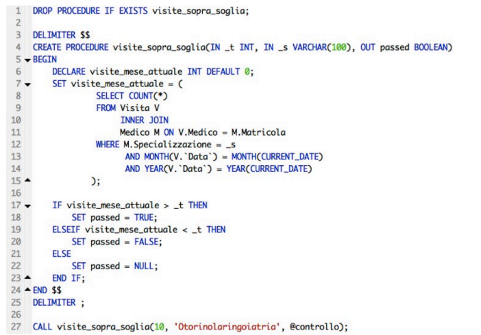

Sono blocchi di codice memorizzati nel database che possono essere richiamati a richiesta. (Come delle funzioni).

Per delimitare un blocco di funzione si usa DELIMITER $ $
e poi CREATE PROCEDURE *nomeprocedura* (*eventuali variabili*),  con eventuale controllo DROP PROCEDURE IF EXIST *nomeprocedura*, nel caso in cui questa esista già nel DBMS.
Per iniziare il blocco di funzione, si mette un inizio, **BEGIN** e una volta terminato il blocco **END** e poi di nuovo DELIMITER; .
Per chiamare una funzione si usa la funzione CALL.

---
## VARIABILI

RICORDA che tutte le variabili utilizzate vanno prima dichiarate nel body.
### VALORI IN INGRESSO E IN USCITA

Di default i valori sono in ingresso:
SE dichiarati **IN** possono essere letti ma non modificati,
mentre se passati come **OUT** possono essere modificati.
(E' parallelo al passaggio per riferimento e valore in C++: IN è come passare il valore, mentre OUT  è come passare il riferimento, con risultato l'effettiva modifica nel database).

TUTTE LE VARIABILI DEVONO ESSERE DICHIARATE ALL'INIZIO DEL BLOCCO DI FUNZIONE:
DECLARE *nomevariabile* *tipovariabile* DEFAULT *valore* (di default sono tutte NULL).

###### FUNZIONE SET:
permette assegnare un valore ad una variabile.
Con SET si fa: SET *nomevariabile* = ( := se non si usa SET) *valore*.
Invece si può fare SELECT + INTO, selezionando un valore qualsiasi da un result set e inserendolo nella variabile.

#### VARIABILI USER-DEFINED
Sono inizializzate dall'utente e non serve quindi dichiararle e il loro ciclo di vita dura fino alla connessione al MySQL server. Il problema è che la tipizzazione è debole non avendo un tipo specificato. Il contenuto è visibile ovunque ma solo dall'utente che lo dichiara.
E' SOLO DI TIPO SCALARE, non può contenere un result set.

---

### ISTRUZIONI CONDIZIONALI

IF e CASE:
si possono usare per modificare il flusso di esecuzione in base al risultato dell'istruzione:

es. 
Scrivere una stored procedure che riceva come parametro un intero t e una specializzazione s e restituisca in uscita true se il numero di visite della specializzazione s nel mese in corso è superiore a t, false se è inferiore, e NULL se è uguale.

Il CASE lavora come lo SWITCH in C++.

---
#### ISTRUZIONI RIPETITIVE

WHILE lavora come in C++: WHILE condizione (che viene controllata prima di ogni iterazione) DO *blocco funzione* e poi END WHILE.

REPEAT *blocco istruzioni* UNTIL *condizione* (questo rappresenta la condizione di uscita: if TRUE esce) e poi END REPEAT;  la condizione viene controllata dopo l'iterazione del blocco di codice. 

---
### LOOP
Si dichiara con loop_label: LOOP
*blocco di istruzioni*
END LOOP

Le funzioni LEAVE e ITERATE permettono di interrompere un ciclo o passare all'iterazione successiva: il LEAVE è l'equivalente del break in C++.

---
### CURSORI 
Un cursore è come un puntatore, il qual permette di navigare all'interno delle tabelle **SOLO IN AVANTI** per fare cose all'interno di istruzioni iterative.
Si dichiara:
**DECLARE** NomeCursore CURSOR FOR (query SQL);
(VANNO DICHIARATI SUBITO DOPO TUTTE LE VARIABILI)
Per usare un cursore bisogna: 
- aprirlo (OPEN NomeCursore);
- prelevare ciò che ci serve (FETCH NomeCursore INTO ListaVariabili);
- richiuderlo (CLOSE NomeCursore);

---
### HANDLER

L'**handler** è il gestore di situazioni, utili pure per riconoscere la fine del result set quando si usano i cursori.
(Si possono definire subito dopo i cursori e le variabili).
es.
##### NOT FOUNT HANDLER:
DECLARE CONTINUE HANDLER FOR NOT FOUND
SET finito=1;
(Quando non trova più un oggetto, setta finito su '1', ovvero TRUE, ed indica che la lista è finita).

---
### INSERIMENTO

Permette di inserire un nuovo record i cui valori possono essere sia statici che ricavati.

INSERT INTO NomeTabella (posso omettere lo schema se metto tutti i valori rispettando l'ordine o in alternativa si scelgono gli attributi da mettere)
VALUES (valori) OPPURE Queryperselezionare (prendo i valori da una query che sia però coerente come risultati)

---
### AGGIORNAMENTO

UPGRADE NomeTabella
SET aggiornamenti

---
### CANCELLAZIONE
DELETE FROM NomeTabella
WHERE Condizione

